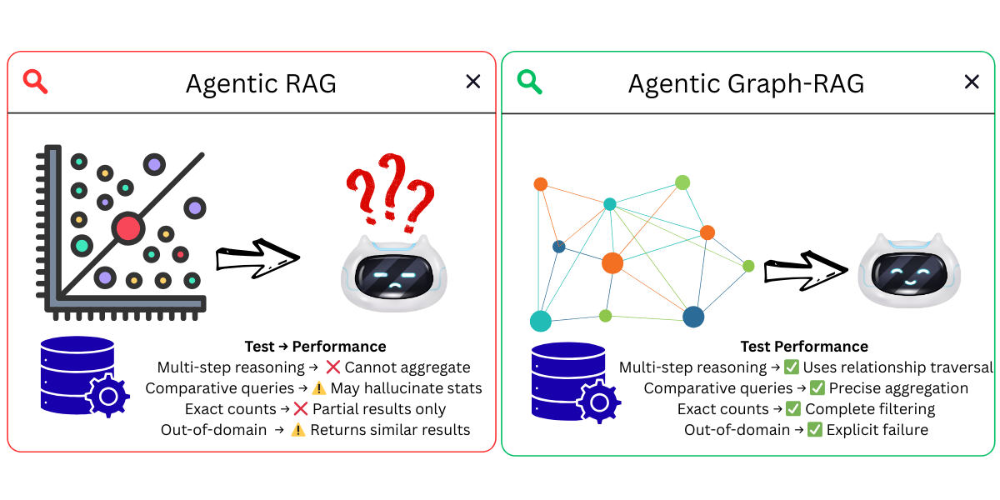
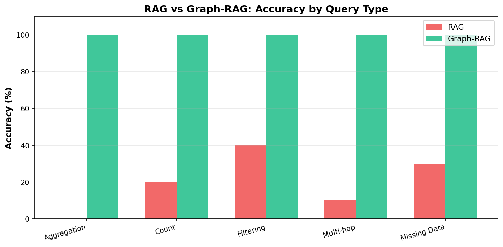
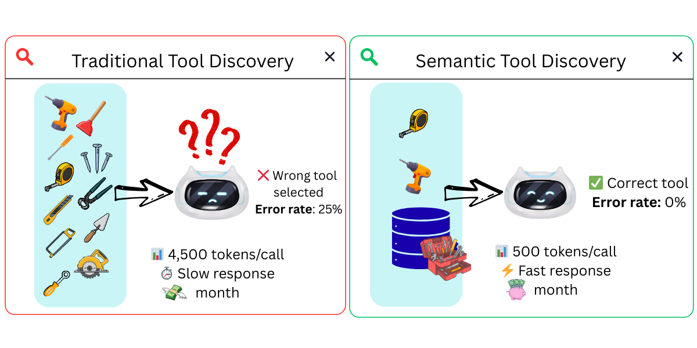
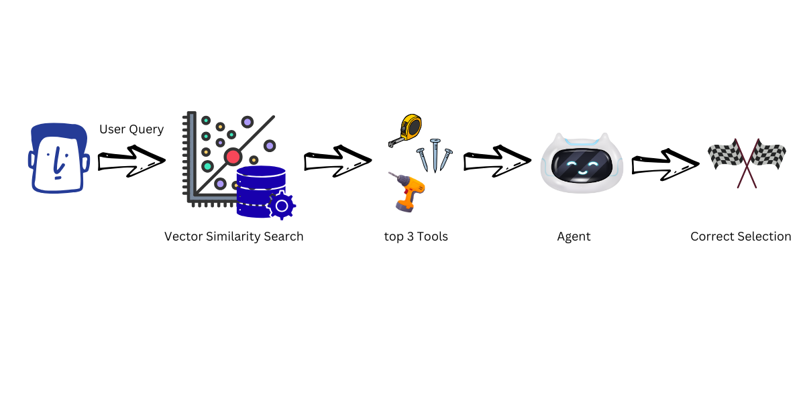
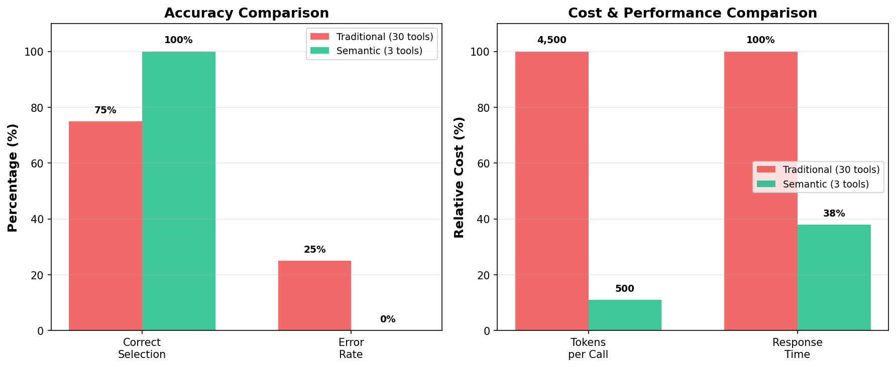
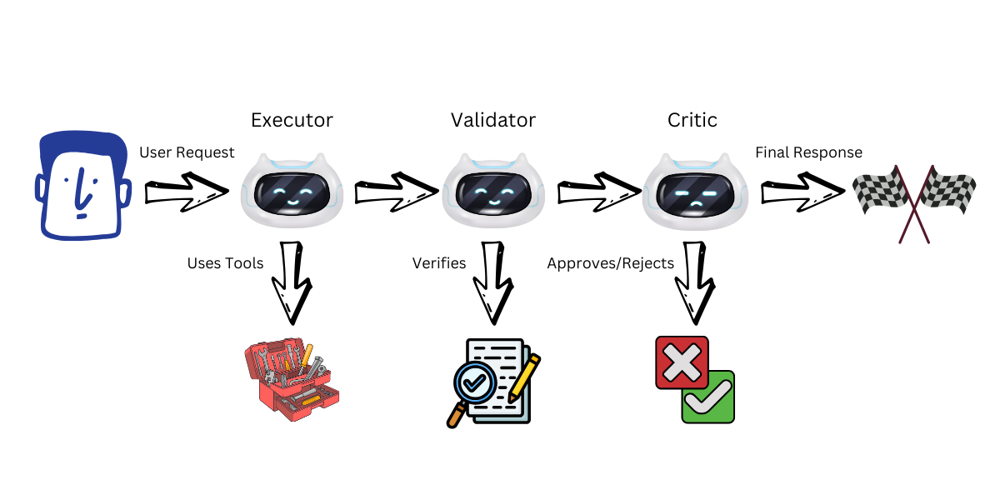
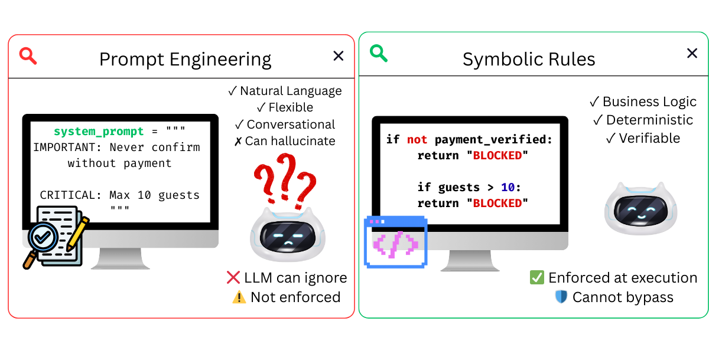

# Stop AI Agent Hallucinations: 5 Essential Techniques

[](../LICENSE)
[](https://python.org)
[](https://strandsagents.com)
[](https://aws.amazon.com/bedrock/)

Research-backed techniques to stop AI agent hallucinations: Graph-RAG for precise data retrieval, semantic tool selection for accurate tool choice, multi-agent validation for error detection, and neurosymbolic guardrails for rule enforcement.

> This demo uses Strands Agents. Similar patterns can be applied in LangGraph, AutoGen, or other agent frameworks.

⭐ **[Star this repository](https://github.com/aws-samples/sample-why-agents-fail)** to follow updates • **[Start Learning](01-faq-graphrag-demo/)** with Demo 01

---

## Demos

| Demo | Description | Stack |
|------|-------------|-------|
| [01 - Graph-RAG vs RAG](01-faq-graphrag-demo/) | Compare RAG vs Graph-RAG on 300 hotel FAQs. Graph-RAG eliminates statistical hallucinations with native database aggregations. |    |
| [02 - Semantic Tool Selection](02-semantic-tools-demo/) | Filter 29 tools down to the top 3 relevant per query. Reduces wrong tool selection and token costs significantly. |    |
| [03 - Multi-Agent Validation](03-multiagent-demo/) | Executor → Validator → Critic pattern catches hallucinations before they reach users. Detects invalid hotels, fabricated stats, and silent failures. |   |
| [04 - Neurosymbolic Guardrails](04-neurosymbolic-demo/) | Combine LLM flexibility with symbolic rules. Business logic enforced at the tool level — the LLM cannot bypass it. |   |
| [05 - Agent Control](05-agent-control-demo/) | Steer instead of block. Agent Control guides the agent to self-correct violations instead of failing — completing the task without user intervention. |   |

---

## How Each Demo Works

### Demo 01: Graph-RAG vs Traditional RAG

Traditional RAG returns top-k text chunks — the LLM guesses aggregations and fabricates statistics. Graph-RAG executes precise Cypher queries on a knowledge graph and computes exact results.



**Accuracy by query type — aggregation, count, filtering, multi-hop, missing data:**



---

### Demo 02: Semantic Tool Selection

When an agent has many tools, it picks the wrong one and wastes tokens describing all of them. Semantic filtering uses FAISS vector search to pre-select only the most relevant tools per query.



**Flow: query → vector similarity search → top 3 tools → agent → correct selection**



**Accuracy and token cost comparison:**



---

### Demo 03: Multi-Agent Validation

A single agent has no mechanism to detect its own hallucinations. The Executor → Validator → Critic pattern cross-validates each response before it reaches the user.



---

### Demo 04: Neurosymbolic Guardrails

Prompt engineering is a suggestion — the LLM can ignore it. Symbolic rules enforced via Strands Hooks intercept every tool call and block violations before execution.



---

### Demo 05: Agent Control — Steer Instead of Block

Hooks block violations and stop the workflow. Agent Control introduces **steer controls** — when a rule is violated, the agent receives corrective guidance via `Guide()` and retries with the fix applied, completing the task without user intervention.


**Flow: User Request → LLM → Agent Control server evaluates → Self-Correct → Final Response**


---

## Quick Start

> **Prerequisites:** Python 3.9+, OpenAI API key (or Amazon Bedrock), `uv` package manager

### 1. Clone and choose a demo

```bash
git clone https://github.com/aws-samples/sample-why-agents-fail
cd stop-ai-agent-hallucinations/01-faq-graphrag-demo  # or any other demo
```

### 2. Install dependencies

```bash
uv venv && uv pip install -r requirements.txt
```

### 3. Configure API key

```bash
cp .env.example .env
# Edit .env and add OPENAI_API_KEY=your-key
# Get your key at https://platform.openai.com/api-keys
```

### 4. Run

```bash
# Demo 01 (requires Neo4j — see 01-faq-graphrag-demo/README.md for setup)
uv run load_vector_data_lite.py && uv run build_graph_lite.py
uv run travel_agent_demo.py

# Demo 02
# Open test_semantic_tools_hallucinations.ipynb in Jupyter, Kiro, or your preferred notebook environment

# Demo 03
uv run test_multiagent_hallucinations.py

# Demo 04
uv run test_neurosymbolic_hooks.py

# Demo 05 (requires Agent Control server — see 05-agent-control-demo/README.md for setup)
uv run setup_controls.py
uv run test_hooks_vs_control.py
```

---

## Key Findings

| Technique | Problem Solved | What to Expect |
|-----------|---------------|----------------|
| **Graph-RAG** | Statistical hallucinations, incomplete retrieval | Graph-RAG answers aggregation and count queries correctly where RAG guesses |
| **Semantic Tool Selection** | Wrong tool selection, token waste | Fewer tokens per call and lower error rate vs passing all tools on every query |
| **Multi-Agent Validation** | Silent failures, undetected hallucinations | Invalid hotel detected and returned FAILED instead of silently substituted |
| **Neurosymbolic Rules** | Business rule violations, prompt bypass | Rules enforced at hook level — cannot be circumvented by prompt manipulation |
| **Agent Control (Steer)** | Blocked workflows, user friction | Agent self-corrects violations and completes the task — no user intervention needed |

---

## Technologies Used

| Technology | Purpose |
|------------|---------|
| [Strands Agents](https://strandsagents.com) | AI agent framework — tool calling, hooks, swarm orchestration |
| [Neo4j](https://neo4j.com) | Graph database for relationship-aware queries and precise aggregations |
| [FAISS](https://github.com/facebookresearch/faiss) | Vector similarity search for semantic tool filtering |
| [SentenceTransformers](https://www.sbert.net/) | Local text embeddings — no API cost, swap for any provider |
| [neo4j-graphrag](https://neo4j.com/docs/neo4j-graphrag-python/current/) | Automatic knowledge graph construction from documents |
| [Agent Control](https://github.com/agentcontrol/agent-control) | Runtime control plane — steer, deny, and manage agent policies via API |

---

## Research Background

- [RAG-KG-IL: Multi-Agent Hybrid Framework for Reducing Hallucinations](https://arxiv.org/pdf/2503.13514) — KG reduces hallucinations vs standalone LLMs
- [Internal Representations as Indicators of Hallucinations in Agent Tool Selection](https://arxiv.org/abs/2601.05214) — Tool selection errors increase with tool count
- [Teaming LLMs to Detect and Mitigate Hallucinations](https://arxiv.org/pdf/2510.19507) — Multi-agent debate detects errors single agents miss
- [MetaRAG: Metamorphic Testing for Hallucination Detection](https://arxiv.org/pdf/2509.09360) — Hallucinations are inherent to LLMs without structured grounding

---

## Troubleshooting

**OpenTelemetry warnings:** Ignore "Failed to detach context" — does not affect functionality.

**API errors:** Check `.env` has a valid `OPENAI_API_KEY`. Get one at [platform.openai.com/api-keys](https://platform.openai.com/api-keys).

**Neo4j not found:** Graph-RAG demo (01) requires Neo4j Desktop with the APOC plugin. Demos 02, 03, and 04 run without it.

**Model alternatives:** All demos work with OpenAI, Amazon Bedrock, Anthropic, or Ollama — see [Strands Model Providers](https://strandsagents.com/latest/documentation/docs/user-guide/concepts/model-providers/).

---

## Contributing

Contributions are welcome! See [CONTRIBUTING](../CONTRIBUTING.md) for more information.

---

## Security

If you discover a potential security issue in this project, notify AWS/Amazon Security via the [vulnerability reporting page](http://aws.amazon.com/security/vulnerability-reporting/). Please do **not** create a public GitHub issue.

---

## License

This library is licensed under the MIT-0 License. See the [LICENSE](../LICENSE) file for details.
