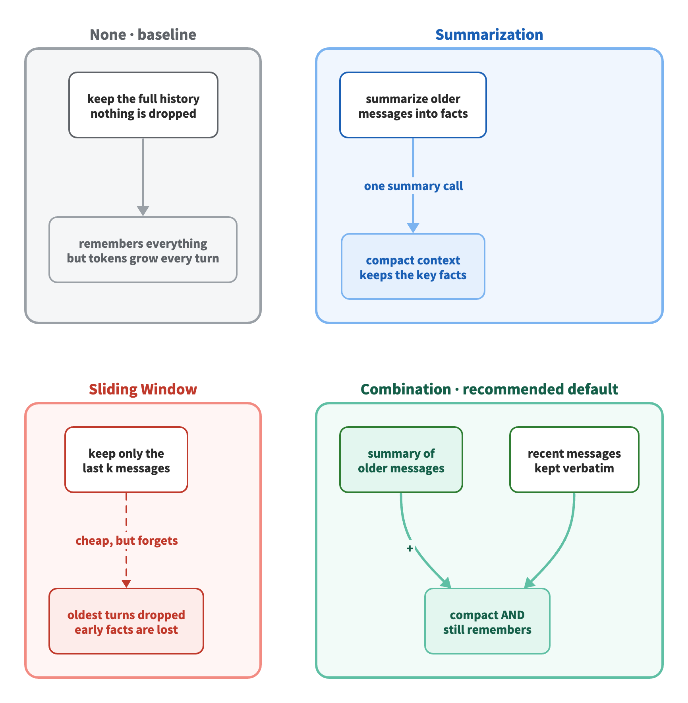
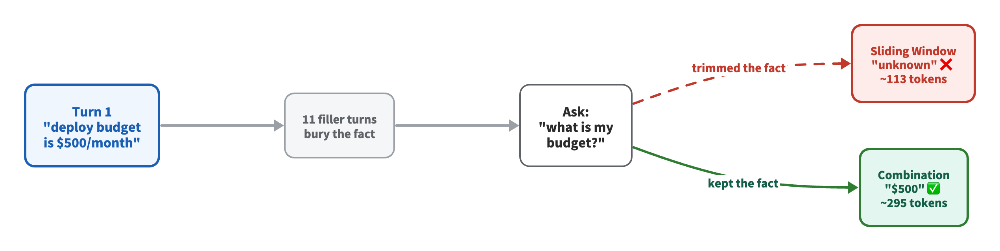

# Conversation Management: the built-in default for context engineering

**What is conversation management?** It is the built-in strategy an agent uses to curate its conversation history so the context window stays small and relevant. Before reaching for advanced patterns (memory pointers, RAG, multi-agent), Strands Agents already ships this — often a one-line default is enough.

**Problem:** Every turn you keep in history is re-sent to the model and re-billed. Keep everything and tokens grow without limit; trim blindly and the agent forgets facts it needs.

**Solution:** A conversation manager with an eviction policy. This demo compares the four built-in options on the same conversation and the same recall question.

> This demo uses Strands Agents. Sliding window, summarization, and combination are general agent concepts and carry over to other agent frameworks.

---

## 🎯 What This Demo Shows



Four built-in strategies, one conversation, one question:

| Strategy | What it does | Strands API |
|----------|--------------|-------------|
| **None** (baseline) | Keep the full history, nothing dropped | `NullConversationManager()` |
| **Sliding Window** | Keep only the most recent messages | `SlidingWindowConversationManager(window_size=N)` |
| **Summarization** | Summarize older messages, keep few/none verbatim | `SummarizingConversationManager(preserve_recent_messages=0)` |
| **Combination** | Summary of older messages **+** recent ones kept verbatim | `SummarizingConversationManager(summary_ratio=..., preserve_recent_messages=N)` |

**The probe:** the user states the deploy budget (`$500/month`) in turn 1, then 11 filler turns bury it. At the end we ask *"what is my budget?"* and check whether each strategy still remembers — and how many tokens the query costs.



---

## 📊 Demo Results

Measured with the native Strands token metric (`response.metrics.accumulated_usage["totalTokens"]`) on `gpt-4o-mini`. Token counts vary slightly between runs because the summary is generated live by the model.

| Strategy | Messages kept | Query tokens | Remembered budget? |
|----------|--------------:|-------------:|:------------------:|
| None (baseline) | 24 | ~343 | ✅ |
| Sliding Window (`window_size=6`) | 6 | ~113 | ❌ |
| Summarization (`ratio=0.8, preserve=0`) | 6 | ~197 | ✅ |
| Combination (`ratio=0.5, preserve=4`) | 13 | ~300 | ✅ |

**Key finding:** Sliding Window is the cheapest context but trims the early fact, so it answers *"unknown."* Combination keeps tokens far below the full baseline **and** still remembers — it summarizes older turns while keeping recent ones verbatim. That is why it is the recommended general-purpose default.

---

## 🚀 Quick Start

### Prerequisites

- Python 3.9+
- OpenAI API key

> You can swap to any provider supported by Strands — see [Strands Model Providers](https://strandsagents.com/docs/user-guide/concepts/model-providers/) for configuration.

### Installation

```bash
uv venv && uv pip install -r requirements.txt
```

### Configure

Create a `.env` file with your key:

```bash
OPENAI_API_KEY=your-key-here
```

### Run

Batch comparison (prints the table above):

```bash
uv run python test_conversation_management.py
```

Or open the notebook:

```bash
jupyter notebook test_conversation_management.ipynb
```

---

## 💬 Live chat (for demos and recordings)

`chat.py` is an interactive chat that shows the active strategy curating the context after every turn — ideal for a live demo or a screen recording.

```bash
uv run python chat.py                 # starts on the Combination strategy
uv run python chat.py sliding         # start on a specific strategy
```

Commands inside the chat:

| Command | Action |
|---------|--------|
| `/strategy none\|sliding\|summary\|combination` | Switch strategy (keeps history) |
| `/compact` | Force summarization/trim now |
| `/context` | Print the current managed history |
| `/reset` | Clear the conversation |
| `/help` | List commands |
| `/quit` | Exit |

**Suggested recording script** (run the same conversation under two strategies):

1. `/strategy sliding`
2. Type: *"My deploy budget is \$500/month, remember it."*
3. Chat 5–6 filler turns — watch the status line trim messages.
4. Ask *"what is my monthly deploy budget?"* → it has forgotten.
5. `/reset` then `/strategy combination`
6. Repeat steps 2–3, then `/compact`
7. Ask again → it remembers.

> Switching to Combination *after* Sliding Window already trimmed the fact cannot bring it back — the data is gone. That is why the honest comparison resets and replays the conversation under each strategy.

---

## 🧠 When to use which

- **Sliding Window** — short-lived tasks where only recent context matters and old turns are safe to forget. Fast and cheap, no extra model call.
- **Summarization** — long conversations where old details still matter but need not be verbatim.
- **Combination** — the recommended general-purpose default: recent turns exact, older turns summarized.

Conversation management is the *starting point*. When a single tool returns a large indivisible blob (logs, documents) that would overflow the window in one shot, move on to the **Memory Pointer Pattern** in [`01-context-overflow-demo`](../01-context-overflow-demo/).

---

## 📚 References

- [Strands Agents — Conversation Management](https://strandsagents.com/docs/user-guide/concepts/agents/conversation-management/)
- [Strands Agents — Model Providers](https://strandsagents.com/docs/user-guide/concepts/model-providers/)
