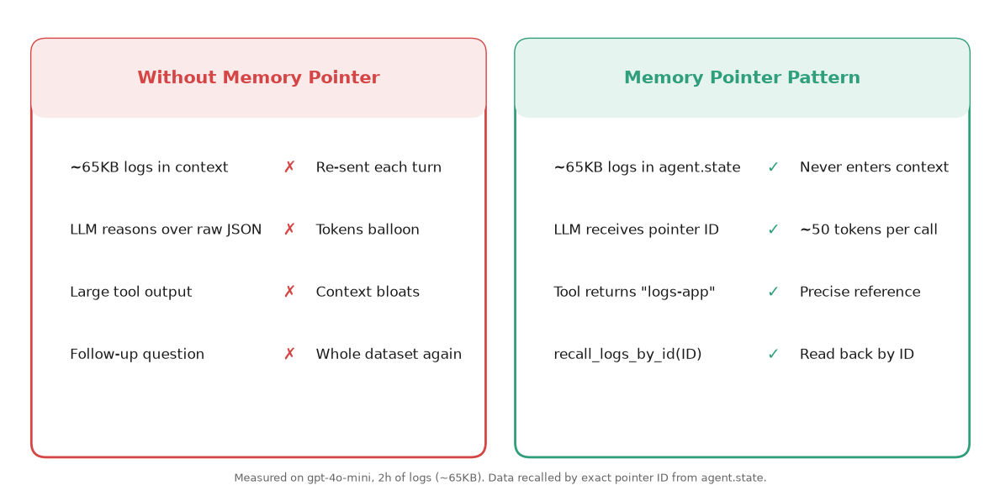
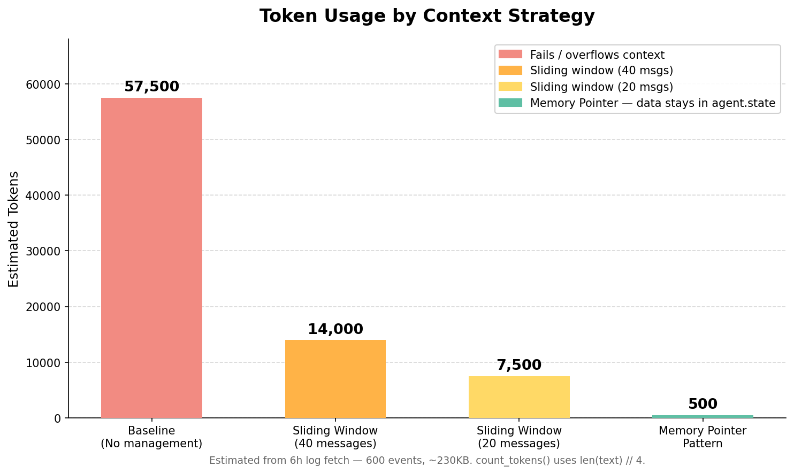
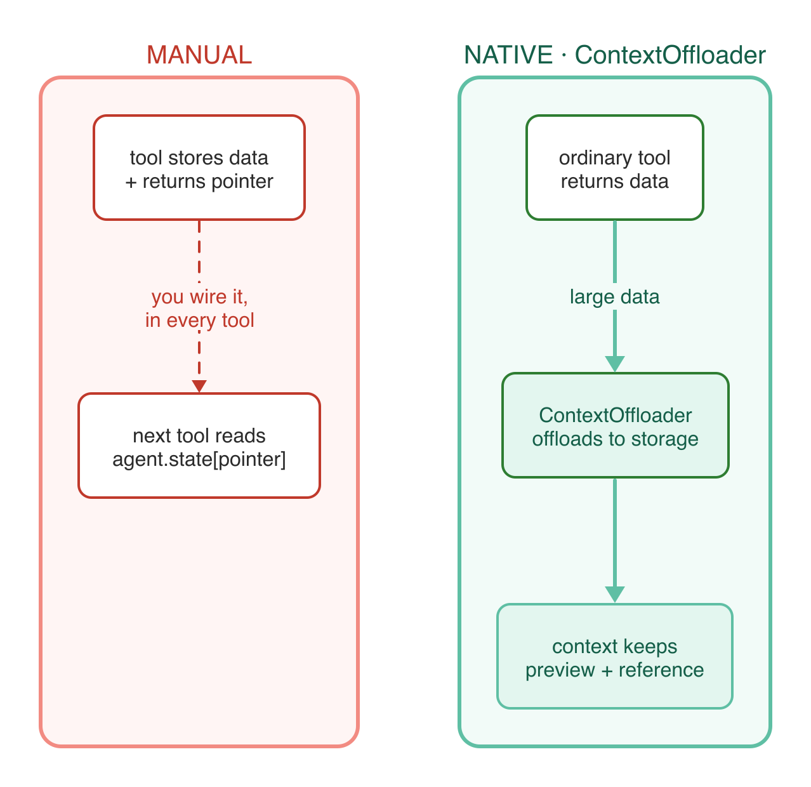

# Fix AI Agent Context Window Overflow: Memory Pointer Pattern (IBM Research)

**Problem:** AI agents fail when tool outputs exceed the context window, preventing task completion.

**Solution:** Memory Pointer Pattern - Store large data outside context, interact with pointers instead of raw data.

Based on IBM Research paper: [Solving Context Window Overflow in AI Agents](https://arxiv.org/html/2511.22729v1)

---

## 🎯 What This Demo Shows

### Real-World Scenario: Log Analysis System

An AI agent processes application logs to detect errors and anomalies:

1. **Fetch logs** - Tool returns 24 hours of events (~86,400 events, >5MB)
2. **Analyze patterns** - Requires complete dataset (indivisible)
3. **Generate report** - Combines multiple analyses

**Why this matters:**
- Logs cannot be truncated without losing critical events
- Analysis requires full dataset for accuracy
- Common problem in DevOps/SRE workflows

---



## 📊 Four Scenarios Demonstrated

| Scenario | Approach | Expected Result |
|----------|----------|-----------------|
| **1. Baseline** | No context management | ❌ Fails or degrades |
| **2. Memory Pointer** | IBM Research pattern | ✅ 7x token reduction |
| **3. Custom Window** | Smaller window (20 msgs) | ✅ Further optimization |
| **4. Per-Turn** | Proactive management | ✅ Complex workflows |
| **5. Swarm Multi-Agent** | Collector → Analyzer → Reporter | ✅ Autonomous coordination |



---

## 🚀 Quick Start

### Prerequisites

```bash
# Python 3.9+
python --version

# OpenAI API key
export OPENAI_API_KEY="your-key-here"
```

> You can swap to any provider supported by Strands — see [Strands Model Providers](https://strandsagents.com/docs/user-guide/concepts/model-providers/) for configuration.

### Installation

```bash
uv venv && uv pip install -r requirements.txt
```

### Run Demo

```bash
# Manual Memory Pointer Pattern (agent.state) — single-agent
uv run python test_context_overflow.py

# Native Memory Pointer Pattern (ContextOffloader + context_manager="auto")
uv run python test_native_pointer.py

# Multi-agent Swarm demo (Collector → Analyzer → Reporter)
uv run python swarm_demo.py

# Quick test
uv run python quick_test.py

# Interactive chats — naive (raw JSON in context) vs pointer (recall by ID)
uv run python chat_naive.py
uv run python chat_pointer.py

# Jupyter notebooks
# Manual:  test_context_overflow.ipynb        Native:  test_native_pointer.ipynb
# Swarm:   test_multiagent_context_overflow.ipynb
# Open in Jupyter, Kiro, or your preferred notebook environment
```

---

## 📁 Files

| File | Purpose |
|------|---------|
| `tools.py` | **Manual** pattern — tools use `ToolContext` + `agent.state` to store/return pointers |
| `test_context_overflow.py` | Manual single-agent demo (naive vs `agent.state`) |
| `test_context_overflow.ipynb` | Interactive manual-pattern notebook |
| `native_tools.py` | **Native** pattern — ordinary log tools, no pointer logic inside them |
| `test_native_pointer.py` | Native demo: no management vs `ContextOffloader` vs `context_manager="auto"` |
| `test_native_pointer.ipynb` | Interactive native-pattern notebook |
| `chat_naive.py` | Interactive chat — raw JSON floods the context (the problem) |
| `chat_pointer.py` | Interactive chat — data in `agent.state`, recalled by pointer ID (the fix) |
| `swarm_demo.py` | Multi-agent Swarm demo (Collector → Analyzer → Reporter) |
| `test_multiagent_context_overflow.ipynb` | Interactive Swarm notebook with follow-up investigation |
| `quick_test.py` | Quick smoke test |
| `requirements.txt` | Dependencies |

---

## 🔬 How It Works

### Problem: Large Tool Outputs

```python
# Tool returns 86,400 log events (~5MB JSON)
logs = fetch_application_logs("payment-service", hours=24)

# ❌ This overflows context window
agent.run("Analyze these logs: " + logs)
```

### Solution: Memory Pointer Pattern

```python
# 1. Tool stores large data in agent.state, returns pointer
@tool(context=True)
def fetch_application_logs(app_name: str, tool_context: ToolContext, hours: int = 24) -> str:
    logs = generate_logs(hours)  # Large dataset
    
    if len(logs) > threshold:
        pointer = f"logs-{app_name}"
        tool_context.agent.state.set(pointer, logs)
        return f"Data stored at: {pointer}"
    
    return logs

# 2. Agent receives pointer (small)
# "Fetched 86,400 events. Data stored at: logs-payment-service"

# 3. Next tool resolves pointer from agent.state
@tool(context=True)
def analyze_error_patterns(logs_pointer: str, tool_context: ToolContext) -> str:
    logs = tool_context.agent.state.get(logs_pointer)  # Get actual data
    # ... analyze full dataset
```

**Key Benefits:**
- ✅ No information loss
- ✅ 7x token reduction (paper result)
- ✅ Transparent to agent
- ✅ Works with any tool

---

## ⚡ Native Memory Pointer Pattern (Strands `ContextOffloader`)

The pattern above is implemented by hand: each tool stores data in `agent.state` and returns a pointer. Strands now ships the **same idea as a first-class plugin** — `ContextOffloader` — so your tools stay ordinary functions and the offloading happens in the framework.



**Run it:** `uv run python test_native_pointer.py` · notebook: `test_native_pointer.ipynb`

### What is the native Memory Pointer Pattern in Strands?

The native Memory Pointer Pattern is `ContextOffloader`, a Strands plugin that intercepts oversized tool results at execution time, stores each content block in a storage backend, and replaces the in-context result with a short preview plus a reference — keeping large data out of the LLM context window without any pointer logic inside your tools.

```python
from strands import Agent
from strands.vended_plugins.context_offloader import ContextOffloader, FileStorage
from native_tools import fetch_application_logs, count_errors_by_service

# Tools are ordinary functions — no agent.state, no pointer arguments
agent = Agent(
    model=MODEL,
    tools=[fetch_application_logs, count_errors_by_service],
    plugins=[ContextOffloader(storage=FileStorage("./artifacts"),
                              max_result_tokens=800, preview_tokens=200)],
)
agent("Fetch 2 hours of logs for 'api-gateway' and tell me the top error service.")
```

The plugin registers a `retrieve_offloaded_content(reference)` tool, so the agent can pull full content back **by exact reference** when it truly needs it.

### Manual vs Native

| | Manual (`tools.py`) | Native (`native_tools.py`) |
|---|---|---|
| Fetch tool | Stores in `agent.state`, returns a pointer string | Ordinary function — just returns the JSON |
| Analysis tool | Receives `logs_pointer`, calls `agent.state.get()` | Ordinary function — no pointer logic |
| Who offloads | You, inside every tool | The `ContextOffloader` plugin, outside the tools |
| Retrieval | Read `agent.state` by key | `retrieve_offloaded_content(reference)` — by exact reference |
| Storage | In-process RAM | `InMemoryStorage` or `FileStorage` (local disk) |

> **Offloader is the safety net; selective tools are the win.** `ContextOffloader` guarantees a large result won't flood context. But the biggest savings come from pairing it with a **selective tool** (like `count_errors_by_service`, which computes the answer server-side and returns a small summary). Without a selective tool, an agent that needs the full dataset will just call `retrieve_offloaded_content` and bring it all back.

### One-line setup: `context_manager="auto"`

For most multi-turn agents, you don't configure offloading and summarization separately:

```python
agent = Agent(model=MODEL, tools=[...], context_manager="auto")
```

This composes (with benchmark-validated defaults) a `SummarizingConversationManager` (summarizes old history with proactive compression) **plus** a `ContextOffloader` (in-memory). Any `conversation_manager` or `plugins` you pass take precedence.

> **Measured in this demo** (same query, `gpt-4o-mini`, 2h of logs): no management ≈ 18–20K tokens in context → `ContextOffloader` ≈ 490 tokens (~97% fewer) → `context_manager="auto"` ≈ 1K tokens. Numbers vary per run because log data is randomized; re-run `test_native_pointer.py` to reproduce.

---

## 🐝 Swarm Multi-Agent Demo

The same Memory Pointer Pattern works across multiple agents using [Strands Swarm](https://strandsagents.com/docs/user-guide/concepts/multi-agent/swarm/). Three specialized agents coordinate autonomously, sharing data via `invocation_state`:

```
Collector → Analyzer → Reporter
   │            │           │
   │ fetch logs │ analyze   │ generate
   │ store in   │ read from │ read from
   │ inv_state  │ inv_state │ inv_state
   └────────────┴───────────┘
    tool_context.invocation_state
         (145KB+, shared)
```

All tools use `@tool(context=True)` + `ToolContext` to access `invocation_state` — the official Strands API for [multi-agent data sharing](https://strandsagents.com/docs/user-guide/concepts/multi-agent/multi-agent-patterns/):

```python
from strands import Agent, tool, ToolContext
from strands.multiagent import Swarm

@tool(context=True)
def fetch_application_logs(app_name: str, tool_context: ToolContext, hours: int = 6) -> str:
    logs = generate_logs(hours)  # 145KB+
    pointer = f"logs-{app_name}"
    tool_context.invocation_state[pointer] = logs  # Shared across all agents
    return f"Stored as '{pointer}'. Hand off to analyzer."

@tool(context=True)
def analyze_error_patterns(logs_pointer: str, tool_context: ToolContext) -> str:
    logs = tool_context.invocation_state.get(logs_pointer)  # Read from shared state
    errors = [l for l in logs if l["level"] == "ERROR"]
    result = {"total_errors": len(errors), ...}
    tool_context.invocation_state["error_analysis"] = result
    return json.dumps(result)

collector = Agent(name="collector", tools=[fetch_application_logs], ...)
analyzer = Agent(name="analyzer", tools=[analyze_error_patterns, ...], ...)
reporter = Agent(name="reporter", tools=[generate_incident_report], ...)

swarm = Swarm([collector, analyzer, reporter], entry_point=collector)
result = swarm("Fetch logs, analyze, and generate incident report")
# Status: COMPLETED | Agents: collector → analyzer → reporter | ~14s
```

After the swarm completes, the data stays in `invocation_state` for follow-up investigation — no re-fetching needed.

**Key difference from single-agent:**
- Single-agent: `tool_context.agent.state` (scoped to one agent)
- Multi-agent: `tool_context.invocation_state` (shared across all agents in the swarm)

Both use the same `ToolContext` API — just different stores.

---

## 📊 Expected Results

### Scenario 1: Baseline (Fails)
```
❌ Context overflow or severe performance degradation
📊 Estimated tokens: 150,000+
```

### Scenario 2: Memory Pointer (Succeeds)
```
✅ Success
📊 Estimated tokens: ~20,000 (7x reduction)
📦 Memory store entries: 3
🔗 Memory Pointers:
  - fetch_logs-a3f2b1c8: 5,234,567 bytes
  - analyze_errors-f9d4e2a1: 12,345 bytes
```

### Scenario 3: Custom Window (Optimized)
```
✅ Success
📊 Estimated tokens: ~15,000
💬 Messages in window: 20
```

### Scenario 4: Per-Turn (Proactive)
```
✅ Success with proactive management
📊 Estimated tokens: ~18,000
```

---

## 🔑 Key Concepts

### 1. Context Window Overflow

**What happens:**
- Tool returns large output (>100KB)
- Agent tries to add to context
- Context window fills up
- Agent fails or performance degrades

**Why it matters:**
- Cannot truncate indivisible data (logs, matrices, datasets)
- Summarization loses critical information
- Blocks entire workflow

### 2. Memory Pointer Pattern

**How it works:**
1. **Store** - Large data stored in `agent.state`
2. **Pointer** - Tool returns small reference key
3. **Resolve** - Next tool reads from `agent.state` automatically
4. **Transparent** - Agent doesn't know it's using pointers

**From IBM Research:**
- 20M tokens → 1,234 tokens (Materials Science experiment)
- 6,411 tokens → 841 tokens (SDS extraction experiment)
- ~7x reduction in both cases

### 3. Sliding Window Conversation Manager

**Strands built-in solution:**
```python
from strands.agent.conversation_manager import SlidingWindowConversationManager

agent = Agent(
    model=OpenAIModel(model_id="gpt-4o-mini"),
    conversation_manager=SlidingWindowConversationManager(
        window_size=40,  # Keep last 40 messages
        per_turn=True    # Apply every model call
    ),
    tools=[...]
)
```

**Features:**
- Automatic trimming when window exceeds size
- Preserves tool pairs (toolUse + toolResult)
- Automatic retry on overflow
- Per-turn or per-N-calls management

---

## 🎓 Learning Objectives

After completing this demo, you will understand:

1. ✅ Why context overflow happens with large tool outputs
2. ✅ How Memory Pointer Pattern solves the problem
3. ✅ When to use different context management strategies
4. ✅ How to implement the pattern in your own agents
5. ✅ Trade-offs between different approaches

---

## 🔄 Use Amazon Bedrock or Anthropic

These demos use OpenAI by default, but the token-counting and hook patterns work the same with any [Strands model provider](https://strandsagents.com/docs/user-guide/concepts/model-providers/). To switch, replace the `OpenAIModel(...)` line where `MODEL` is defined.

### Option A — Amazon Bedrock

Bedrock uses `boto3` (the AWS SDK), so **no extra package is required** — it ships with Strands.

```python
from strands.models import BedrockModel

MODEL = BedrockModel(
    model_id="us.anthropic.claude-sonnet-4-20250514-v1:0",
    region_name="us-east-1",
)
```

**How to get AWS credentials for Bedrock:**

1. **Create an AWS account** if you don't have one: https://aws.amazon.com/free
2. **Install the AWS CLI**: see the [official install guide](https://docs.aws.amazon.com/cli/latest/userguide/getting-started-install.html).
3. **Create access keys** in the AWS Console under **IAM → Users → Security credentials → Create access key** (choose "Command Line Interface").
4. **Configure your credentials** locally:
   ```bash
   aws configure
   # AWS Access Key ID:     <your-access-key-id>
   # AWS Secret Access Key: <your-secret-access-key>
   # Default region name:   us-east-1
   ```
   This stores credentials in `~/.aws/credentials`. Strands and `boto3` pick them up automatically — no API key in code.
5. **Enable model access**: in the [Amazon Bedrock console](https://console.aws.amazon.com/bedrock/), go to **Model access** and request access to the model you plan to use (e.g. Anthropic Claude). Approval is usually immediate.
6. **Ensure your IAM user/role allows** `bedrock:InvokeModel` and `bedrock:InvokeModelWithResponseStream`.

> Already using AWS SSO, an EC2/Lambda role, or environment variables (`AWS_ACCESS_KEY_ID`, `AWS_SECRET_ACCESS_KEY`, `AWS_REGION`)? Those work too — `boto3` resolves credentials from the standard [credential chain](https://docs.aws.amazon.com/sdkref/latest/guide/standardized-credentials.html).

Docs: [Strands · Amazon Bedrock](https://strandsagents.com/docs/user-guide/concepts/model-providers/amazon-bedrock/)

### Option B — Anthropic (direct API)

Requires the `anthropic` extra:

```bash
uv pip install 'strands-agents[anthropic]'
```

```python
import os
from strands.models.anthropic import AnthropicModel

MODEL = AnthropicModel(
    client_args={"api_key": os.getenv("ANTHROPIC_API_KEY")},
    model_id="claude-sonnet-4-6",
    max_tokens=1028,
)
```

Get an API key at https://console.anthropic.com/. Docs: [Strands · Anthropic](https://strandsagents.com/docs/user-guide/concepts/model-providers/anthropic/)

---

## 🔧 Customization

### Adjust Log Size

```python
# In tools.py, change hours parameter
logs = fetch_application_logs("app-name", hours=48)  # 2 days
```

### Add Custom Tools

```python
from strands import tool, ToolContext

@tool(context=True)
def your_custom_tool(data_pointer: str, tool_context: ToolContext) -> str:
    """Your tool that works with pointers."""
    data = tool_context.agent.state.get(data_pointer)
    # ... process data
    return result
```

---

## 📚 References

### Research Papers
- [Solving Context Window Overflow in AI Agents](https://arxiv.org/html/2511.22729v1) — IBM Research, Nov 2025
- [Towards Effective GenAI Multi-Agent Collaboration](https://arxiv.org/pdf/2412.05449) — Amazon, Dec 2024. Payload referencing between agents
- [Context Window Limits Explained](https://airbyte.com/agentic-data/context-window-limit) — Airbyte, Dec 2025

### Strands Documentation
- [Agent State](https://strandsagents.com/docs/user-guide/concepts/agents/state/) — ToolContext and agent.state
- [Conversation Management](https://strandsagents.com/docs/user-guide/concepts/agents/conversation-management/) — Sliding window and context overflow
- [Swarm](https://strandsagents.com/docs/user-guide/concepts/multi-agent/swarm/) — Multi-agent orchestration

---

## 🐛 Troubleshooting

**"OPENAI_API_KEY not set"**
```bash
export OPENAI_API_KEY="your-key-here"
# Or create .env file with: OPENAI_API_KEY=your-key-here
```

**"Module not found: strands"**
```bash
pip install strands-agents
```

**OpenTelemetry warnings**
- Ignore "Failed to detach context" warnings
- They don't affect functionality

**Agent still fails with overflow**
- Reduce `hours` parameter in `fetch_application_logs()`
- Increase `window_size` in `SlidingWindowConversationManager`
- Check if Memory Pointer Pattern is working (look for "Data stored at:" in output)

---

## 💡 Next Steps

1. ✅ Complete this demo
2. ➡️ Try [Demo 02: MCP Tools Not Responding](../02-mcp-timeout-demo/) - Handle external APIs that stop responding
3. ➡️ Try [Demo 03: Reasoning Loops](../03-reasoning-loops-demo/) - Prevent infinite loops

---

## 📄 License

MIT-0 License. See [LICENSE](../../LICENSE) for details.
