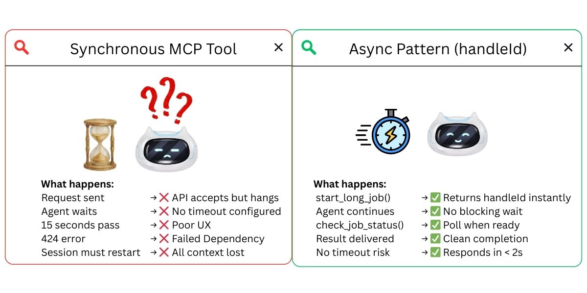
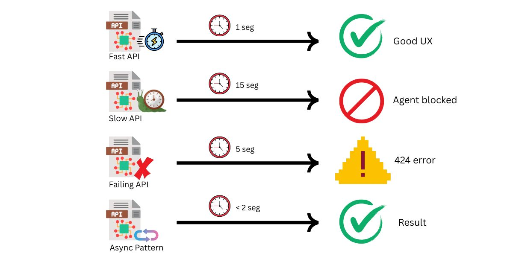
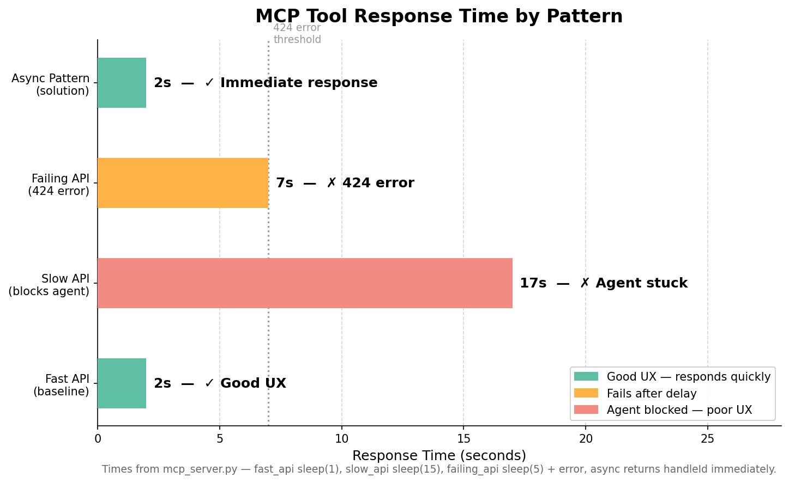

# Fix MCP Tool 424 Timeout Errors: Async HandleId Pattern

**Problem:** MCP tools calling external APIs can stop responding indefinitely, cause 424 errors, or enter unresponsive states — blocking the entire agent workflow.

**Solution:** Async handleId pattern — return immediately with a tracking ID, poll for results.

Based on research:
- [Resilient AI Agents With MCP](https://octopus.com/blog/mcp-timeout-retry) — Octopus, May 2025
- [Call remote MCP server tool timed out, error 424](https://community.openai.com/t/call-remote-mcp-server-tool-timed-out-resulting-in-error-424/1364167) — OpenAI Community

---

## 🎯 What This Demo Shows

### Real-World Scenario: External API Integration

An AI agent uses MCP tools to call external APIs. Four scenarios demonstrate the problem and solution:

1. **Fast API** — Responds in 1s (baseline, good UX)
2. **Slow API** — Responds in 15s (agent waits, poor UX)
3. **Failing API** — 424 Failed Dependency after 5s (agent errors)
4. **Async Pattern** — Returns handle immediately, polls for result (solution)

The MCP server also includes an `unresponsive_api` (300s, never completes) to demonstrate the worst case — a request that stops responding entirely.

---

## 📊 Four Scenarios



| Scenario | API Behavior | Total Time | User Experience |
|----------|-------------|------------|-----------------|
| **1. Fast API** | 1s response | ~3s | ✅ Good |
| **2. Slow API** | 15s response | ~18s | ❌ Agent waits |
| **3. Failing API** | 424 after 5s | ~8s | ❌ Error |
| **4. Async Pattern** | Immediate handle + poll | ~4s | ✅ Solution |





---

## 🚀 Quick Start

### Prerequisites

- Python 3.9+
- OpenAI API key

> You can swap to any provider supported by Strands — see [Strands Model Providers](https://strandsagents.com/docs/user-guide/concepts/model-providers/) for configuration.

### Installation

```bash
uv venv && uv pip install -r requirements.txt
```

### Configure

Create a `.env` file:
```bash
OPENAI_API_KEY=your-key-here
```

### Run Demo

```bash
uv run python test_mcp_timeout.py
```

---

## 📁 Files

| File | Purpose |
|------|---------|
| `mcp_server.py` | MCP server with 6 tools simulating timeout scenarios |
| `test_mcp_timeout.py` | Main demo — runs 4 scenarios comparing problem vs solution |
| `test_mcp_timeout.ipynb` | Interactive Jupyter notebook |
| `requirements.txt` | Dependencies |

---

## 🔬 How It Works

### MCP Server — Simulated Timeout Scenarios

```python
from mcp.server import FastMCP
import asyncio, uuid

mcp = FastMCP("Timeout Scenarios Server")
JOBS = {}

# Problem: Slow API — agent waits 15 seconds
@mcp.tool(description="Slow API - takes 15 seconds")
async def slow_api(query: str) -> str:
    await asyncio.sleep(15)
    return f"SUCCESS: Slow response for '{query}'"

# Solution: Start job immediately, return handle
@mcp.tool(description="Start long-running job, returns handle immediately")
async def start_long_job(task: str) -> str:
    job_id = str(uuid.uuid4())[:8]
    JOBS[job_id] = {"status": "processing", "task": task, "result": None}
    asyncio.create_task(process_in_background(job_id, task))
    return f"JOB_STARTED: {job_id} - Use check_job_status to get result"

# Solution: Poll for result
@mcp.tool(description="Check status of long-running job")
async def check_job_status(job_id: str) -> str:
    job = JOBS.get(job_id)
    if job["status"] == "completed":
        return f"COMPLETED: {job['result']}"
    return f"PROCESSING: Job {job_id} still running"
```

### Agent Integration with Strands

```python
from strands import Agent
from strands.models.openai import OpenAIModel
from strands.tools.mcp import MCPClient
from mcp import stdio_client, StdioServerParameters

mcp_client = MCPClient(
    lambda: stdio_client(
        StdioServerParameters(command="python", args=["mcp_server.py"])
    )
)

agent = Agent(model=OpenAIModel(model_id="gpt-4o-mini"), tools=[mcp_client])
```

---

## 💡 The Async HandleId Pattern

**Strands Agents makes this simple**: use `MCPClient` to connect any MCP server in two lines. The async pattern works with any MCP tool — no special Strands integration needed beyond the standard `MCPClient`.

The key insight from research: **respond to the MCP request ASAP** to avoid timeouts.

```
Traditional:  User → Agent → MCP Tool → [15s wait] → Response
Async:        User → Agent → start_job → "handle: abc123" (instant)
              User → Agent → check_status("abc123") → "COMPLETED: result"
```

The agent gets an immediate response and can poll, do other work, or inform the user while the job processes in the background.

---

## 🔄 Use Amazon Bedrock or Anthropic

These demos use OpenAI by default, but the token-counting and hook patterns work the same with any [Strands model provider](https://strandsagents.com/docs/user-guide/concepts/model-providers/). To switch, replace the `OpenAIModel(...)` line where `MODEL` is defined.

### Option A — Amazon Bedrock

Bedrock uses `boto3` (the AWS SDK), so **no extra package is required** — it ships with Strands.

```python
from strands.models import BedrockModel

MODEL = BedrockModel(
    model_id="us.anthropic.claude-sonnet-4-20250514-v1:0",
    region_name="us-east-1",
)
```

**How to get AWS credentials for Bedrock:**

1. **Create an AWS account** if you don't have one: https://aws.amazon.com/free
2. **Install the AWS CLI**: see the [official install guide](https://docs.aws.amazon.com/cli/latest/userguide/getting-started-install.html).
3. **Create access keys** in the AWS Console under **IAM → Users → Security credentials → Create access key** (choose "Command Line Interface").
4. **Configure your credentials** locally:
   ```bash
   aws configure
   # AWS Access Key ID:     <your-access-key-id>
   # AWS Secret Access Key: <your-secret-access-key>
   # Default region name:   us-east-1
   ```
   This stores credentials in `~/.aws/credentials`. Strands and `boto3` pick them up automatically — no API key in code.
5. **Enable model access**: in the [Amazon Bedrock console](https://console.aws.amazon.com/bedrock/), go to **Model access** and request access to the model you plan to use (e.g. Anthropic Claude). Approval is usually immediate.
6. **Ensure your IAM user/role allows** `bedrock:InvokeModel` and `bedrock:InvokeModelWithResponseStream`.

> Already using AWS SSO, an EC2/Lambda role, or environment variables (`AWS_ACCESS_KEY_ID`, `AWS_SECRET_ACCESS_KEY`, `AWS_REGION`)? Those work too — `boto3` resolves credentials from the standard [credential chain](https://docs.aws.amazon.com/sdkref/latest/guide/standardized-credentials.html).

Docs: [Strands · Amazon Bedrock](https://strandsagents.com/docs/user-guide/concepts/model-providers/amazon-bedrock/)

### Option B — Anthropic (direct API)

Requires the `anthropic` extra:

```bash
uv pip install 'strands-agents[anthropic]'
```

```python
import os
from strands.models.anthropic import AnthropicModel

MODEL = AnthropicModel(
    client_args={"api_key": os.getenv("ANTHROPIC_API_KEY")},
    model_id="claude-sonnet-4-6",
    max_tokens=1028,
)
```

Get an API key at https://console.anthropic.com/. Docs: [Strands · Anthropic](https://strandsagents.com/docs/user-guide/concepts/model-providers/anthropic/)

---

## 📚 References

- [Resilient AI Agents With MCP](https://octopus.com/blog/mcp-timeout-retry) — Octopus, May 2025
- [Call remote MCP server tool timed out, error 424](https://community.openai.com/t/call-remote-mcp-server-tool-timed-out-resulting-in-error-424/1364167) — OpenAI Community
- [Strands MCP Tools](https://strandsagents.com/docs/user-guide/concepts/tools/mcp-tools/) — Connect any MCP server with MCPClient
- [Strands Model Providers](https://strandsagents.com/docs/user-guide/concepts/model-providers/) — Swap to Amazon Bedrock, Anthropic, Ollama
- [Strands Agents Documentation](https://strandsagents.com) — Full framework docs

---

## 🐛 Troubleshooting

**"OPENAI_API_KEY not set"** — Create `.env` file or `export OPENAI_API_KEY=your-key`

**MCP server not starting** — Verify `mcp_server.py` is in the same directory and `mcp` package is installed

**OpenTelemetry warnings** — Ignore "Failed to detach context" warnings, they don't affect functionality

---

## 💡 Next Steps

1. ✅ Complete this demo
2. ➡️ Try [Demo 01: Context Overflow](../01-context-overflow-demo/) — Memory Pointer Pattern
3. ➡️ Try [Demo 03: Reasoning Loops](../03-reasoning-loops-demo/) — Debounce Hook

---

## 📄 License

MIT-0 License. See [LICENSE](../../LICENSE) for details.
