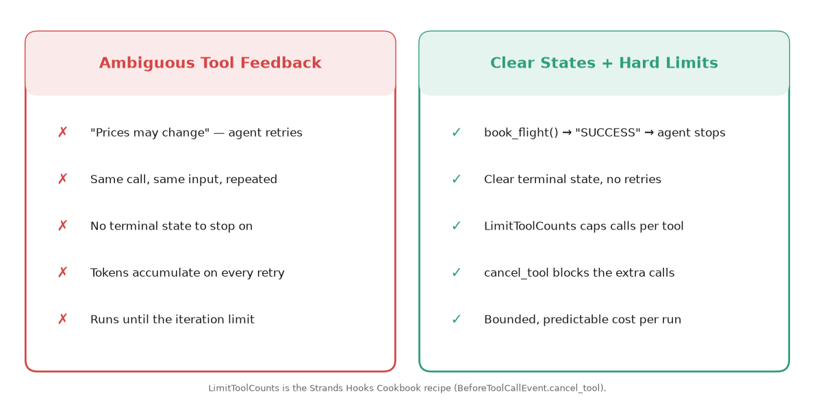
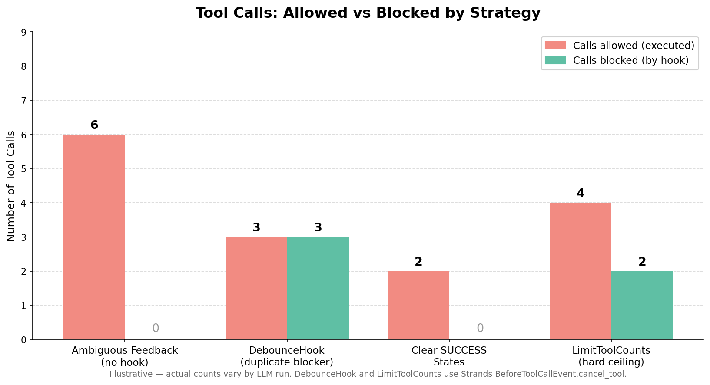

# Stop AI Agent Reasoning Loops: Clear States and Hard Limits

**Problem:** AI agents get stuck calling the same tool repeatedly, burning tokens without delivering answers.

**Solution:** Clear SUCCESS/FAILED tool states signal completion, and `LimitToolCounts` (a recipe from the Strands Hooks Cookbook) enforces a hard ceiling on tool calls per invocation.

> This demo uses Strands Agents. The same patterns — unambiguous tool results and a per-invocation call ceiling enforced by a lifecycle hook — are general agent concepts and carry over to other agent frameworks.

Based on research:
- [Language models can overthink](https://the-decoder.com/language-models-can-overthink-and-get-stuck-in-endless-thought-loops/) — The Decoder, Jan 2025
- [How many reasoning steps do AI agents need](https://particula.tech/blog/ai-agent-loops-reasoning-steps-optimization) — Particula, Jul 2025. 847 steps at $47/min
- [How to Prevent Infinite Loops](https://codieshub.com/for-ai/prevent-agent-loops-costs) — CodiesHub, Dec 2025

---

## 🎯 What This Demo Shows

Three scenarios demonstrate why agents loop and how to stop them:

1. **Ambiguous Feedback** — Tools return "prices may change" → agent retries organically
2. **Clear SUCCESS States** — Tools return SUCCESS/FAILED → agent stops immediately
3. **LimitToolCounts** — Hard ceiling on tool calls per invocation (Strands Cookbook)



---

## 📊 Demo Results

Representative values from one run of `test_reasoning_loops.py` on `gpt-4o-mini`. Counts vary per run because tool prices are randomized and LLM behavior is non-deterministic — re-run to reproduce.

| Scenario | Tool Calls | Time | Result |
|----------|-----------|------|--------|
| Ambiguous Feedback | ~6 | ~7s | Agent retried organically |
| Clear SUCCESS States | 2 | ~2s | Agent stopped on SUCCESS |
| LimitToolCounts | 6 (2 blocked) | ~5s | Hard ceiling enforced |

**Key finding:** Ambiguous tools drove several redundant retries; clear SUCCESS states let the agent stop in 2 calls, and `LimitToolCounts` caps the total regardless of how many times the model tries.



---

## 🚀 Quick Start

### Prerequisites

- Python 3.9+
- OpenAI API key

> You can swap to any provider supported by Strands — see [Strands Model Providers](https://strandsagents.com/docs/user-guide/concepts/model-providers/) for configuration.

### Installation

```bash
uv venv && uv pip install -r requirements.txt
```

### Configure

Create `.env`:
```bash
OPENAI_API_KEY=your-key-here
```

### Run

```bash
uv run python test_reasoning_loops.py
```

### Try it interactively

Two chats let you watch the difference live — same ambiguous tools, the only change is the hook:

```bash
uv run python chat_loop.py      # no protection — tool calls pile up
uv run python chat_guarded.py   # LimitToolCounts caps the calls (🚫 Limit reached!)
```

Ask both `Find me the cheapest flight from NYC to Paris under $400 and a hotel under $200/night`, then type `exit`.

---

## 📁 Files

| File | Purpose |
|------|---------|
| `test_reasoning_loops.py` | Main demo — 3 scenarios with real metrics |
| `tools.py` | Ambiguous tools (cause loops) vs clear-state tools (prevent loops) |
| `hooks.py` | `LimitToolCounts` — the Strands Hooks Cookbook recipe, copied verbatim |
| `test_reasoning_loops.ipynb` | Interactive notebook |
| `chat_loop.py` | Interactive chat with no loop protection (the problem) |
| `chat_guarded.py` | Interactive chat with `LimitToolCounts` attached (the fix) |
| `requirements.txt` | Dependencies |

---

## 🔬 How It Works

### Ambiguous Tools Cause Organic Loops

```python
@tool
def search_flights(origin: str, destination: str, max_price: float) -> str:
    """Search for flights under a max price."""
    prices = [random.randint(200, 800) for _ in range(3)]
    matching = [p for p in prices if p <= max_price]
    return (
        f"Found {len(matching)} flights under ${max_price}. "
        "Note: More results may be available. Prices change frequently."
    )
```

The agent sees "More results may be available" and retries. In our demo runs, this drove several redundant tool calls for a single query (the exact count varies per run).

### Clear States Stop Loops

```python
@tool
def book_hotel(hotel: str, guest: str, nights: int) -> str:
    """Book a hotel room. Returns clear SUCCESS or FAILED."""
    if random.random() > 0.15:
        conf = f"HT{random.randint(10000, 99999)}"
        return f"SUCCESS: Booking {conf} confirmed — {guest} at {hotel}, {nights} nights"
    return f"FAILED: {hotel} fully booked"
```

The agent receives `"SUCCESS: Booking HT79265 confirmed"` and stops — typically **2 tool calls** (flight + hotel), no retries.

### Hard Limits with LimitToolCounts

`LimitToolCounts` is the official recipe from the [Strands Hooks Cookbook](https://strandsagents.com/docs/user-guide/concepts/agents/hooks/) (see the **Cookbook → Limit Tool Counts** section). Strands does not ship it as an importable class — the Cookbook shows the code so you copy it into your project. Our `hooks.py` is that recipe, verbatim:

```python
from hooks import LimitToolCounts

limit_hook = LimitToolCounts(max_tool_counts={
    "search_flights": 3,
    "check_hotel_price": 3,
})

agent = Agent(tools=[search_flights, check_hotel_price], hooks=[limit_hook])
```

It registers on `BeforeInvocationEvent` (to reset counts each invocation) and `BeforeToolCallEvent` (to count and cancel). Even if the agent wants to search 10 times, once a tool passes its ceiling the next call is cancelled via [`event.cancel_tool`](https://strandsagents.com/docs/user-guide/concepts/agents/hooks/) — a native Strands API that blocks the tool and returns a message to the LLM. Hard ceiling, predictable costs, regardless of LLM behavior.

---

## 🔄 Use Amazon Bedrock or Anthropic

These demos use OpenAI by default, but the token-counting and hook patterns work the same with any [Strands model provider](https://strandsagents.com/docs/user-guide/concepts/model-providers/). To switch, replace the `OpenAIModel(...)` line where `MODEL` is defined.

### Option A — Amazon Bedrock

Bedrock uses `boto3` (the AWS SDK), so **no extra package is required** — it ships with Strands.

```python
from strands.models import BedrockModel

MODEL = BedrockModel(
    model_id="us.anthropic.claude-sonnet-4-20250514-v1:0",
    region_name="us-east-1",
)
```

**How to get AWS credentials for Bedrock:**

1. **Create an AWS account** if you don't have one: https://aws.amazon.com/free
2. **Install the AWS CLI**: see the [official install guide](https://docs.aws.amazon.com/cli/latest/userguide/getting-started-install.html).
3. **Create access keys** in the AWS Console under **IAM → Users → Security credentials → Create access key** (choose "Command Line Interface").
4. **Configure your credentials** locally:
   ```bash
   aws configure
   # AWS Access Key ID:     <your-access-key-id>
   # AWS Secret Access Key: <your-secret-access-key>
   # Default region name:   us-east-1
   ```
   This stores credentials in `~/.aws/credentials`. Strands and `boto3` pick them up automatically — no API key in code.
5. **Enable model access**: in the [Amazon Bedrock console](https://console.aws.amazon.com/bedrock/), go to **Model access** and request access to the model you plan to use (e.g. Anthropic Claude). Approval is usually immediate.
6. **Ensure your IAM user/role allows** `bedrock:InvokeModel` and `bedrock:InvokeModelWithResponseStream`.

> Already using AWS SSO, an EC2/Lambda role, or environment variables (`AWS_ACCESS_KEY_ID`, `AWS_SECRET_ACCESS_KEY`, `AWS_REGION`)? Those work too — `boto3` resolves credentials from the standard [credential chain](https://docs.aws.amazon.com/sdkref/latest/guide/standardized-credentials.html).

Docs: [Strands · Amazon Bedrock](https://strandsagents.com/docs/user-guide/concepts/model-providers/amazon-bedrock/)

### Option B — Anthropic (direct API)

Requires the `anthropic` extra:

```bash
uv pip install 'strands-agents[anthropic]'
```

```python
import os
from strands.models.anthropic import AnthropicModel

MODEL = AnthropicModel(
    client_args={"api_key": os.getenv("ANTHROPIC_API_KEY")},
    model_id="claude-sonnet-4-6",
    max_tokens=1028,
)
```

Get an API key at https://console.anthropic.com/. Docs: [Strands · Anthropic](https://strandsagents.com/docs/user-guide/concepts/model-providers/anthropic/)

---

## 📚 References

### Research
- [Language models can overthink](https://the-decoder.com/language-models-can-overthink-and-get-stuck-in-endless-thought-loops/) — The Decoder, Jan 2025
- [How many reasoning steps do AI agents need](https://particula.tech/blog/ai-agent-loops-reasoning-steps-optimization) — Particula, Jul 2025
- [How to Prevent Infinite Loops](https://codieshub.com/for-ai/prevent-agent-loops-costs) — CodiesHub, Dec 2025

### Strands Documentation
- [Strands Hooks](https://strandsagents.com/docs/user-guide/concepts/agents/hooks/) — Lifecycle events and tool cancellation
- [Hooks Cookbook](https://strandsagents.com/docs/user-guide/concepts/agents/hooks/) — LimitToolCounts and other patterns

---

## 🐛 Troubleshooting

**"OPENAI_API_KEY not set"** — Create `.env` file or `export OPENAI_API_KEY=your-key`

**No loops detected** — LLM behavior varies. The "persistent agent" prompt increases retry likelihood.

**Hook not blocking** — Verify the hook is registered: `Agent(..., hooks=[limit_hook])`

---

## 💡 Next Steps

1. ✅ Complete this demo
2. ➡️ Try [Demo 01: Context Overflow](../01-context-overflow-demo/) — Memory Pointer Pattern
3. ➡️ Try [Demo 02: MCP Timeout](../02-mcp-timeout-demo/) — Async handleId pattern

---

## 📄 License

MIT-0 License. See [LICENSE](../../LICENSE) for details.
