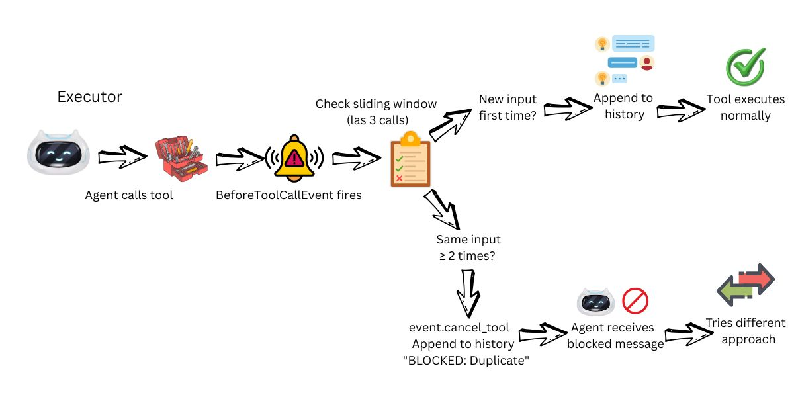

# Stop AI Agent Reasoning Loops: Debounce Hooks and Hard Limits

**Problem:** AI agents get stuck calling the same tool repeatedly, burning tokens without delivering answers.

**Solution:** Strands Hooks — DebounceHook detects duplicate calls, clear SUCCESS/FAILED states signal completion, and LimitToolCounts enforces hard ceilings.

Based on research:
- [Language models can overthink](https://the-decoder.com/language-models-can-overthink-and-get-stuck-in-endless-thought-loops/) — The Decoder, Jan 2025
- [How many reasoning steps do AI agents need](https://particula.tech/blog/ai-agent-loops-reasoning-steps-optimization) — Particula, Jul 2025. 847 steps at $47/min
- [How to Prevent Infinite Loops](https://codieshub.com/for-ai/prevent-agent-loops-costs) — CodiesHub, Dec 2025

---

## 🎯 What This Demo Shows

Four scenarios demonstrate why agents loop and how to stop them:

1. **Ambiguous Feedback** — Tools return "prices may change" → agent retries organically
2. **DebounceHook** — Blocks duplicate calls with identical parameters
3. **Clear SUCCESS States** — Tools return SUCCESS/FAILED → agent stops immediately
4. **LimitToolCounts** — Hard ceiling on tool calls per invocation (Strands Cookbook)


---

## 📊 Demo Results

| Scenario | Tool Calls | Time | Result |
|----------|-----------|------|--------|
| Ambiguous Feedback | 14 | ~21s | Agent retried organically |
| DebounceHook | 12 | ~15s | Reduced retries |
| Clear SUCCESS States | 2 | ~4s | **7x fewer calls** |
| LimitToolCounts | 6 (2 blocked) | ~6s | Hard ceiling enforced |

**Key finding:** Ambiguous tools caused 14 calls. Clear SUCCESS states reduced it to 2 calls — a 7x improvement.


---

## 🚀 Quick Start

### Prerequisites

- Python 3.9+
- OpenAI API key

### Installation

```bash
uv venv && uv pip install -r requirements.txt
```

### Configure

Create `.env`:
```bash
OPENAI_API_KEY=your-key-here
```

### Run

```bash
uv run python test_reasoning_loops.py
```

---

## 📁 Files

| File | Purpose |
|------|---------|
| `test_reasoning_loops.py` | Main demo — 4 scenarios with real metrics |
| `tools.py` | Ambiguous tools (cause loops) vs clear-state tools (prevent loops) |
| `hooks.py` | DebounceHook + LimitToolCounts (from Strands Cookbook) |
| `test_reasoning_loops.ipynb` | Interactive notebook |
| `requirements.txt` | Dependencies |

---

## 🔬 How It Works

### Ambiguous Tools Cause Organic Loops

```python
@tool
def search_flights(origin: str, destination: str, max_price: float) -> str:
    """Search for flights under a max price."""
    prices = [random.randint(200, 800) for _ in range(3)]
    matching = [p for p in prices if p <= max_price]
    return (
        f"Found {len(matching)} flights under ${max_price}. "
        "Note: More results may be available. Prices change frequently."
    )
```

The agent sees "More results may be available" and retries. In our demo, this caused **14 tool calls** for a single query.

### Clear States Stop Loops

```python
@tool
def book_hotel(hotel: str, guest: str, nights: int) -> str:
    """Book a hotel room. Returns clear SUCCESS or FAILED."""
    if random.random() > 0.15:
        conf = f"HT{random.randint(10000, 99999)}"
        return f"SUCCESS: Booking {conf} confirmed — {guest} at {hotel}, {nights} nights"
    return f"FAILED: {hotel} fully booked"
```

The agent receives `"SUCCESS: Booking HT79265 confirmed"` and stops. **2 tool calls total** (flight + hotel).

### Strands Hooks Block Duplicates

```python
from strands.hooks import HookProvider, BeforeToolCallEvent

class DebounceHook(HookProvider):
    def check_duplicate(self, event):
        key = (event.tool_use["name"], str(event.tool_use["input"]))
        recent = self.call_history[-self.window_size:]
        
        if recent.count(key) >= 2:
            event.cancel_tool = "BLOCKED: Duplicate call detected"
            return
        
        self.call_history.append(key)

agent = Agent(tools=[search_flights], hooks=[DebounceHook()])
```

Uses [`BeforeToolCallEvent.cancel_tool`](https://strandsagents.com/latest/documentation/docs/user-guide/concepts/agents/hooks/) — a native Strands API that prevents tool execution and returns an error message to the LLM.



### Hard Limits with LimitToolCounts

From the [Strands Hooks Cookbook](https://strandsagents.com/latest/documentation/docs/user-guide/concepts/agents/hooks/):

```python
from hooks import LimitToolCounts

limit_hook = LimitToolCounts(max_tool_counts={
    "search_flights": 2,
    "check_hotel_price": 2,
})

agent = Agent(tools=[search_flights, check_hotel_price], hooks=[limit_hook])
```

Even if the agent wants to search 10 times, it's capped at 2. Hard ceiling, predictable costs.

---

## 📚 References

### Research
- [Language models can overthink](https://the-decoder.com/language-models-can-overthink-and-get-stuck-in-endless-thought-loops/) — The Decoder, Jan 2025
- [How many reasoning steps do AI agents need](https://particula.tech/blog/ai-agent-loops-reasoning-steps-optimization) — Particula, Jul 2025
- [How to Prevent Infinite Loops](https://codieshub.com/for-ai/prevent-agent-loops-costs) — CodiesHub, Dec 2025

### Strands Documentation
- [Strands Hooks](https://strandsagents.com/latest/documentation/docs/user-guide/concepts/agents/hooks/) — Lifecycle events and tool cancellation
- [Hooks Cookbook](https://strandsagents.com/latest/documentation/docs/user-guide/concepts/agents/hooks/) — LimitToolCounts and other patterns

---

## 🐛 Troubleshooting

**"OPENAI_API_KEY not set"** — Create `.env` file or `export OPENAI_API_KEY=your-key`

**No loops detected** — LLM behavior varies. The "persistent agent" prompt increases retry likelihood.

**Hook not blocking** — Verify hook is registered: `Agent(..., hooks=[debounce])`

---

## 💡 Next Steps

1. ✅ Complete this demo
2. ➡️ Try [Demo 01: Context Overflow](../01-context-overflow-demo/) — Memory Pointer Pattern
3. ➡️ Try [Demo 02: MCP Timeout](../02-mcp-timeout-demo/) — Async handleId pattern

---

## 📄 License

MIT-0 License. See [LICENSE](../../LICENSE) for details.
