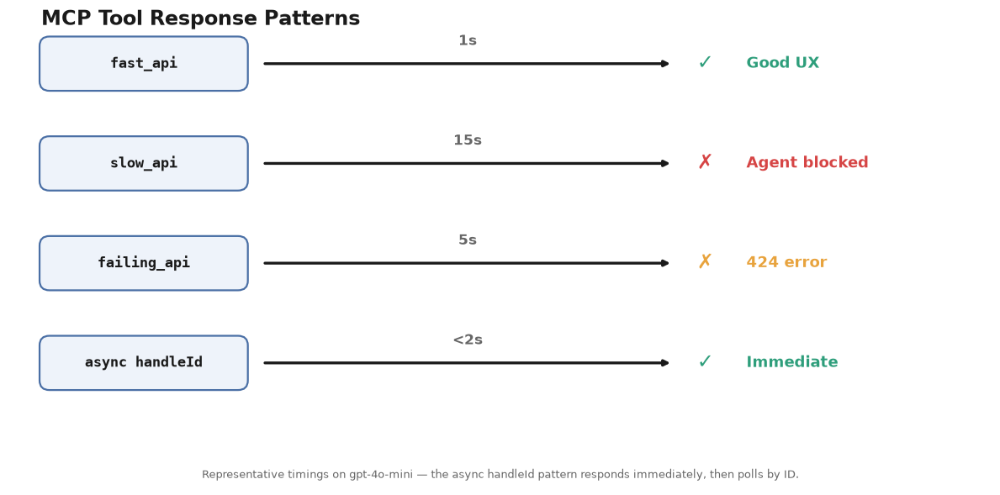

# Stop AI Agents from Wasting Tokens: 3 Essential Fixes

**Research-backed demos showing why AI agents waste tokens and get stuck — and how to fix each issue**

Technical demos that validate research papers with working code examples using the Strands Agents framework. Demos cover the built-in conversation-management default, context window overflow, MCP (Model Context Protocol) tools that stop responding, and reasoning loops.

---

## 📓 Demos Overview

| 📓 Demo | 🎯 Research Validated | ⏱️ Time | 📊 Results |
|---------|----------------------|----------|-----------|
| **[00 - Conversation Management](00-conversation-management-demo/)** | Strands built-in default (starting point) | 15 min | Sliding Window forgets an early fact; Combination stays compact **and** remembers |
| **[01 - Context Window Overflow](01-context-overflow-demo/)** | IBM Research: "Solving Context Window Overflow" | 30 min | Memory Pointer Pattern (manual `agent.state` + native `ContextOffloader`) |
| **[02 - MCP Tools Not Responding](02-mcp-timeout-demo/)** | Octopus: "Resilient AI Agents With MCP" | 20 min | 424 errors reproduced, async handleId solution |
| **[03 - Reasoning Loops](03-reasoning-loops-demo/)** | The Decoder: "Language models can overthink" | 25 min | Loops stopped by clear SUCCESS states + `LimitToolCounts` hard ceiling |

---

## 🎯 What These Demos Validate

### Demo 01: Context Window Overflow

**Research Paper:** [Solving Context Window Overflow in AI Agents](https://arxiv.org/html/2511.22729v1) (IBM Research, Nov 2024)

**Key Finding:** "Indivisible data blocks (logs, documents) cause context overflow when they can't be split"

**Validated (measured in this demo):**
- ✅ Manual Memory Pointer Pattern (`agent.state`) keeps large data out of context
- ✅ Native `ContextOffloader` plugin: baseline ≈18–20K tokens → ≈490 tokens (~97% fewer), same query
- ✅ Data recalled by exact pointer ID without re-entering the context window

**Key Technique:** Store large tool outputs outside the context window — by hand (`agent.state`) or natively (`ContextOffloader`); recall by exact reference.


The demo covers the pattern from first principles to the framework-native plugin:

```python
# 1. Manual — the pattern by hand: tool stores data, returns a pointer
@tool(context=True)
def fetch_application_logs(app_name: str, tool_context: ToolContext, hours: int = 24) -> str:
    logs = generate_logs(hours)                        # Large dataset (tens of KB+)
    tool_context.agent.state.set(f"logs-{app_name}", logs)   # Stored outside context
    return f"Data stored at: logs-{app_name}"          # ~50 tokens returned to LLM

# 2. Native — the framework does it: ordinary tools + the ContextOffloader plugin
agent = Agent(model=MODEL, tools=[fetch_application_logs],
              plugins=[ContextOffloader(storage=FileStorage("./artifacts"))])

# 3. One-line default for multi-turn agents
agent = Agent(model=MODEL, tools=[...], context_manager="auto")
```

See the [demo README](01-context-overflow-demo/) for the manual pattern, the native `ContextOffloader`, and the interactive recall-by-ID chats.

---

### Demo 02: MCP Tools Not Responding

**Research Papers:** 
- [Resilient AI Agents With MCP](https://octopus.com/blog/resilient-ai-agents-with-mcp) (Octopus, May 2025)
- [OpenAI Community: 424 Errors](https://community.openai.com/t/call-remote-mcp-server-tool-timed-out-resulting-in-error-424/1364167)

**Key Finding:** "MCP tools that stop responding cause 424 errors; the agent waits indefinitely"

**Validated (representative timings on gpt-4o-mini, vary per run):**
- ✅ Fast API (~1s work): a few seconds total - good UX
- ✅ Slow API (~15s work): agent blocks the full duration - stuck waiting
- ✅ Failing API: 424 Failed Dependency after the delay - matches research
- ✅ Async handleId: immediate handle in ~2s, then poll by ID - solution works

**Key Technique:** Async pattern with handleId for long-running operations




```python
@mcp.tool()
async def start_analysis(data: str) -> str:
    handle_id = str(uuid.uuid4())
    asyncio.create_task(long_running_task(handle_id, data))
    return f"STARTED: Analysis {handle_id}. Use check_status to poll."

@mcp.tool()
async def check_status(handle_id: str) -> str:
    status = TASK_STATUS.get(handle_id)
    if status == "completed":
        return f"SUCCESS: {TASK_RESULTS[handle_id]}"
    return f"PENDING: Analysis still running"
```

---

### Demo 03: Reasoning Loops

**Research Papers:**
- [Language models can overthink](https://the-decoder.com/language-models-can-overthink-and-get-stuck-in-endless-thought-loops/) (The Decoder, Jan 2025)
- [How many reasoning steps do AI agents need](https://particula.tech/blog/ai-agent-loops-reasoning-steps-optimization) (Particula, Jul 2025)
- [How to Prevent Infinite Loops](https://codieshub.com/for-ai/prevent-agent-loops-costs) (CodiesHub, Dec 2025)

**Key Finding:** "Agents call same tool repeatedly without making progress"

**Validated:**
- ✅ Ambiguous tool feedback drove the agent to retry the same tools repeatedly
- ✅ Clear SUCCESS/FAILED states let the agent stop as soon as the task completed
- ✅ `LimitToolCounts` (Strands Hooks Cookbook) enforced a hard ceiling per tool per invocation

**Key Technique:** Design unambiguous terminal states, and cap tool calls with a `BeforeToolCallEvent` hook.


```python
# LimitToolCounts — the Strands Hooks Cookbook recipe (copied into hooks.py)
class LimitToolCounts(HookProvider):
    def __init__(self, max_tool_counts: dict[str, int]):
        self.max_tool_counts = max_tool_counts
        self.tool_counts = {}

    def register_hooks(self, registry):
        registry.add_callback(BeforeInvocationEvent, self.reset_counts)
        registry.add_callback(BeforeToolCallEvent, self.intercept_tool)

    def intercept_tool(self, event):
        name = event.tool_use["name"]
        self.tool_counts[name] = self.tool_counts.get(name, 0) + 1
        limit = self.max_tool_counts.get(name)
        if limit and self.tool_counts[name] > limit:
            event.cancel_tool = f"Tool '{name}' hit its limit ({limit}). DO NOT CALL IT ANYMORE."
```

---

## 🚀 Quick Start

### Prerequisites

- [Python 3.9+](https://www.python.org/downloads/) (programming language runtime)
- OpenAI API key (or Amazon Bedrock, Anthropic, Ollama) — get one at https://platform.openai.com/api-keys
- `OPENAI_API_KEY` environment variable (a setting that tells your system where to find your API credentials)

> You can swap to any provider supported by Strands — see [Strands Model Providers](https://strandsagents.com/docs/user-guide/concepts/model-providers/) for configuration.

### Run Any Demo

```bash
# Choose a demo
cd 01-context-overflow-demo  # or 02-mcp-timeout-demo or 03-reasoning-loops-demo

# Install dependencies
uv venv && uv pip install -r requirements.txt

# Configure API key
# Create a .env file with: OPENAI_API_KEY=your-key
# Get your key at https://platform.openai.com/api-keys

# Run demo
uv run python test_*.py  # or open test_*.ipynb in your notebook environment
```

---

## 📊 Key Results Summary

| Issue | How the Agent Gets Stuck | Demo Result | Solution |
|-------|--------------------------|-------------|----------|
| **Context Overflow** | Large tool outputs flood the context window | ~65KB logs kept out of context | Memory Pointer Pattern (~97% fewer context tokens in this demo) |
| **MCP Tools Not Responding** | External APIs stop responding or return 424 errors | ~15s block, 424 error reproduced | Async handleId — immediate response, poll by ID |
| **Reasoning Loops** | Agent calls same tool repeatedly without progress | Ambiguous tools retried; clear states stopped in 2 calls | Clear SUCCESS states + `LimitToolCounts` hard ceiling |

---

## 🔧 Technologies Used

| Technology | Purpose | Key Capabilities |
|------------|---------|------------------|
| **[Strands Agents](https://strandsagents.com)** | AI agent framework | Tool calling, hooks, multi-agent orchestration |
| **[OpenAI](https://openai.com)** | LLM provider | GPT-4o-mini for agent reasoning |
| **[MCP](https://modelcontextprotocol.io)** | Tool protocol | Standardized tool communication |
| **[FastMCP](https://github.com/jlowin/fastmcp)** | MCP server | Easy MCP server creation |

---

## 📚 Research References

### Context Window Overflow
- [Solving Context Window Overflow in AI Agents](https://arxiv.org/html/2511.22729v1) - IBM Research, Nov 2024

### MCP Tools Not Responding
- [Resilient AI Agents With MCP](https://octopus.com/blog/resilient-ai-agents-with-mcp) - Octopus, May 2025
- [OpenAI Community: 424 Errors](https://community.openai.com/t/call-remote-mcp-server-tool-timed-out-resulting-in-error-424/1364167)

### Reasoning Loops
- [Language models can overthink](https://the-decoder.com/language-models-can-overthink-and-get-stuck-in-endless-thought-loops/) - The Decoder, Jan 2025
- [How many reasoning steps do AI agents need](https://particula.tech/blog/ai-agent-loops-reasoning-steps-optimization) - Particula, Jul 2025
- [How to Prevent Infinite Loops](https://codieshub.com/for-ai/prevent-agent-loops-costs) - CodiesHub, Dec 2025

---

## 🎯 Key Takeaways

1. **Context Overflow is Real** - large log datasets flood the context; the Memory Pointer Pattern keeps them out (~97% fewer context tokens in this demo; IBM Research reports ~7x on their workloads)
2. **MCP Tools Stop Responding** - Slow APIs cause 424 errors and block the agent, async pattern with handleId fixes it
3. **Agents Loop** - Agents retry ambiguous tools; clear SUCCESS states and a `LimitToolCounts` hard ceiling stop them
4. **Solutions Work** - All research solutions validated with working code

---

## 📖 Additional Resources

- [Strands Agents Documentation](https://strandsagents.com) - Framework documentation
- [Model Context Protocol](https://modelcontextprotocol.io) - MCP specification
- [FastMCP Documentation](https://github.com/jlowin/fastmcp) - MCP server framework

---

## 🔍 Troubleshooting

**OpenTelemetry warnings:** Ignore "Failed to detach context" warnings - they don't affect functionality

**API errors:** Check `.env` file has valid `OPENAI_API_KEY`

**Import errors:** Run `uv pip install -r requirements.txt` in each demo directory

**MCP server not starting:** Ensure `mcp` package is installed: `uv pip install mcp`

---

## Contributing

Contributions are welcome! See [CONTRIBUTING](CONTRIBUTING.md) for more information.

---

## Security

If you discover a potential security issue in this project, notify AWS/Amazon Security via the [vulnerability reporting page](https://aws.amazon.com/security/vulnerability-reporting/). Please do **not** create a public GitHub issue.

---

## 📄 License

This library is licensed under the MIT-0 License. See the [LICENSE](../LICENSE) file for details.
