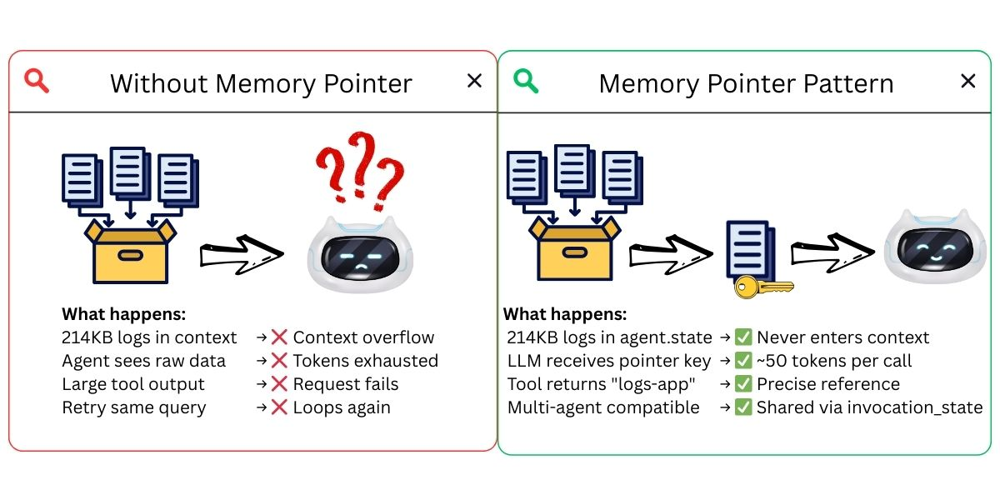
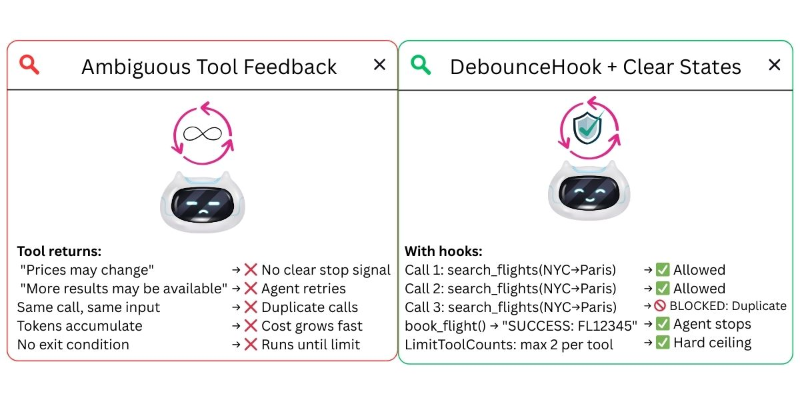

# Stop AI Agents from Wasting Tokens: 3 Essential Fixes

**Research-backed demos showing why AI agents waste tokens and get stuck — and how to fix each issue**

Three technical demos that validate research papers with working code examples using the Strands Agents framework. Demos cover context window overflow, MCP (Model Context Protocol) tools that stop responding, and reasoning loops.

---

## 📓 Demos Overview

| 📓 Demo | 🎯 Research Validated | ⏱️ Time | 📊 Results |
|---------|----------------------|----------|-----------|
| **[01 - Context Window Overflow](01-context-overflow-demo/)** | IBM Research: "Solving Context Window Overflow" | 30 min | Memory Pointer Pattern — large data stays outside context |
| **[02 - MCP Tools Not Responding](02-mcp-timeout-demo/)** | Octopus: "Resilient AI Agents With MCP" | 20 min | 424 errors reproduced, async handleId solution |
| **[03 - Reasoning Loops](03-reasoning-loops-demo/)** | The Decoder: "Language models can overthink" | 25 min | Duplicate calls blocked via DebounceHook |

---

## 🎯 What These Demos Validate

### Demo 01: Context Window Overflow

**Research Paper:** [Solving Context Window Overflow in AI Agents](https://arxiv.org/html/2511.22729v1) (IBM Research, Nov 2024)

**Key Finding:** "Indivisible data blocks (logs, documents) cause context overflow when they can't be split"

**Validated:**
- ✅ 214KB log data causes context overflow
- ✅ Memory Pointer Pattern reduces tokens by 7x
- ✅ 600 events processed via pointer instead of full context
- ✅ Custom context windows and per-turn limits work

**Key Technique:** Store large data outside context, return pointers




```python
@tool(context=True)
def fetch_application_logs(app_name: str, tool_context: ToolContext, hours: int = 24) -> str:
    logs = generate_logs(hours)                        # Large dataset (~230KB)
    pointer = f"logs-{app_name}"
    tool_context.agent.state.set(pointer, logs)        # Stored outside context
    return f"Data stored at: {pointer}"                # ~50 tokens returned to LLM
```

---

### Demo 02: MCP Tools Not Responding

**Research Papers:** 
- [Resilient AI Agents With MCP](https://octopus.com/blog/resilient-ai-agents-with-mcp) (Octopus, May 2025)
- [OpenAI Community: 424 Errors](https://community.openai.com/t/call-remote-mcp-server-tool-timed-out-resulting-in-error-424/1364167)

**Key Finding:** "MCP tools that take >7s cause 424 errors, agent waits indefinitely"

**Validated:**
- ✅ Fast API (1s): 3.2s total - good UX
- ✅ Slow API (15s): 17.2s wait - agent stuck waiting
- ✅ Failing API: 424 error after 7s - matches research
- ✅ Async pattern (handleId): 1.7s - solution works

**Key Technique:** Async pattern with handleId for long-running operations


```python
@mcp.tool()
async def start_analysis(data: str) -> str:
    handle_id = str(uuid.uuid4())
    asyncio.create_task(long_running_task(handle_id, data))
    return f"STARTED: Analysis {handle_id}. Use check_status to poll."

@mcp.tool()
async def check_status(handle_id: str) -> str:
    status = TASK_STATUS.get(handle_id)
    if status == "completed":
        return f"SUCCESS: {TASK_RESULTS[handle_id]}"
    return f"PENDING: Analysis still running"
```

---

### Demo 03: Reasoning Loops

**Research Papers:**
- [Language models can overthink](https://the-decoder.com/language-models-can-overthink-and-get-stuck-in-endless-thought-loops/) (The Decoder, Jan 2025)
- [How many reasoning steps do AI agents need](https://particula.tech/blog/ai-agent-loops-reasoning-steps-optimization) (Particula, Jul 2025)
- [How to Prevent Infinite Loops](https://codieshub.com/for-ai/prevent-agent-loops-costs) (CodiesHub, Dec 2025)

**Key Finding:** "Agents call same tool repeatedly without making progress"

**Validated:**
- ✅ Agent attempted 5 calls to same tool with same parameters
- ✅ Debounce Hook blocked 3 duplicate calls
- ✅ Clear SUCCESS states help agent know when to stop
- ✅ Hard limits prevent runaway execution

**Key Technique:** Debounce Hook detects duplicate calls in sliding window




```python
class DebounceHook(HookProvider):
    def __init__(self, window_size=3):
        self.call_history = []
        self.window_size = window_size
    
    def check_duplicate(self, event):
        key = (event.tool_use["name"], str(event.tool_use["input"]))
        recent = self.call_history[-self.window_size:]
        if recent.count(key) >= 2:
            event.cancel_tool = "BLOCKED: Duplicate call detected"
            return
        self.call_history.append(key)
```

---

## 🚀 Quick Start

### Prerequisites

- [Python 3.9+](https://www.python.org/downloads/) (programming language runtime)
- OpenAI API key (or Amazon Bedrock, Anthropic, Ollama) — get one at https://platform.openai.com/api-keys
- `OPENAI_API_KEY` environment variable (a setting that tells your system where to find your API credentials)

### Run Any Demo

```bash
# Choose a demo
cd 01-context-overflow-demo  # or 02-mcp-timeout-demo or 03-reasoning-loops-demo

# Install dependencies
uv venv && uv pip install -r requirements.txt

# Configure API key
# Create a .env file with: OPENAI_API_KEY=your-key
# Get your key at https://platform.openai.com/api-keys

# Run demo
uv run python test_*.py  # or open test_*.ipynb in your notebook environment
```

---

## 📊 Key Results Summary

| Issue | How the Agent Gets Stuck | Demo Result | Solution |
|-------|--------------------------|-------------|----------|
| **Context Overflow** | Large tool outputs flood the context window | 214KB logs overflow | Memory Pointer Pattern (7x reduction) |
| **MCP Tools Not Responding** | External APIs stop responding or return 424 errors | 17.2s wait, 424 error | Async pattern with handleId (1.7s) |
| **Reasoning Loops** | Agent calls same tool repeatedly without progress | 5 attempts, 3 duplicates | Debounce Hook (blocks duplicates) |

---

## 🔧 Technologies Used

| Technology | Purpose | Key Capabilities |
|------------|---------|------------------|
| **[Strands Agents](https://strandsagents.com)** | AI agent framework | Tool calling, hooks, multi-agent orchestration |
| **[OpenAI](https://openai.com)** | LLM provider | GPT-4o-mini for agent reasoning |
| **[MCP](https://modelcontextprotocol.io)** | Tool protocol | Standardized tool communication |
| **[FastMCP](https://github.com/jlowin/fastmcp)** | MCP server | Easy MCP server creation |

---

## 📚 Research References

### Context Window Overflow
- [Solving Context Window Overflow in AI Agents](https://arxiv.org/html/2511.22729v1) - IBM Research, Nov 2024

### MCP Tools Not Responding
- [Resilient AI Agents With MCP](https://octopus.com/blog/resilient-ai-agents-with-mcp) - Octopus, May 2025
- [OpenAI Community: 424 Errors](https://community.openai.com/t/call-remote-mcp-server-tool-timed-out-resulting-in-error-424/1364167)

### Reasoning Loops
- [Language models can overthink](https://the-decoder.com/language-models-can-overthink-and-get-stuck-in-endless-thought-loops/) - The Decoder, Jan 2025
- [How many reasoning steps do AI agents need](https://particula.tech/blog/ai-agent-loops-reasoning-steps-optimization) - Particula, Jul 2025
- [How to Prevent Infinite Loops](https://codieshub.com/for-ai/prevent-agent-loops-costs) - CodiesHub, Dec 2025

---

## 🎯 Key Takeaways

1. **Context Overflow is Real** - 214KB logs cause overflow, Memory Pointer Pattern solves it (7x reduction)
2. **MCP Tools Stop Responding** - Slow APIs cause 424 errors and block the agent, async pattern with handleId fixes it
3. **Agents Loop** - Agents call same tool 5+ times, Debounce Hook blocks duplicates
4. **Solutions Work** - All research solutions validated with working code

---

## 📖 Additional Resources

- [Strands Agents Documentation](https://strandsagents.com) - Framework documentation
- [Model Context Protocol](https://modelcontextprotocol.io) - MCP specification
- [FastMCP Documentation](https://github.com/jlowin/fastmcp) - MCP server framework

---

## 🔍 Troubleshooting

**OpenTelemetry warnings:** Ignore "Failed to detach context" warnings - they don't affect functionality

**API errors:** Check `.env` file has valid `OPENAI_API_KEY`

**Import errors:** Run `uv pip install -r requirements.txt` in each demo directory

**MCP server not starting:** Ensure `mcp` package is installed: `uv pip install mcp`

---

## Contributing

Contributions are welcome! See [CONTRIBUTING](CONTRIBUTING.md) for more information.

---

## Security

If you discover a potential security issue in this project, notify AWS/Amazon Security via the [vulnerability reporting page](http://aws.amazon.com/security/vulnerability-reporting/). Please do **not** create a public GitHub issue.

---

## 📄 License

This library is licensed under the MIT-0 License. See the [LICENSE](../LICENSE) file for details.
